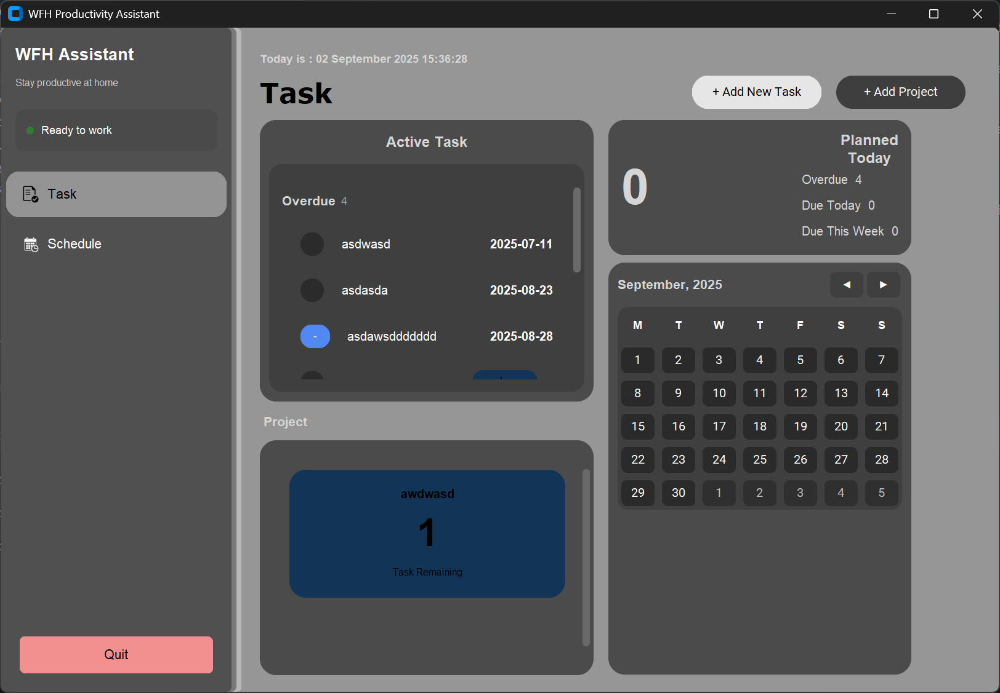
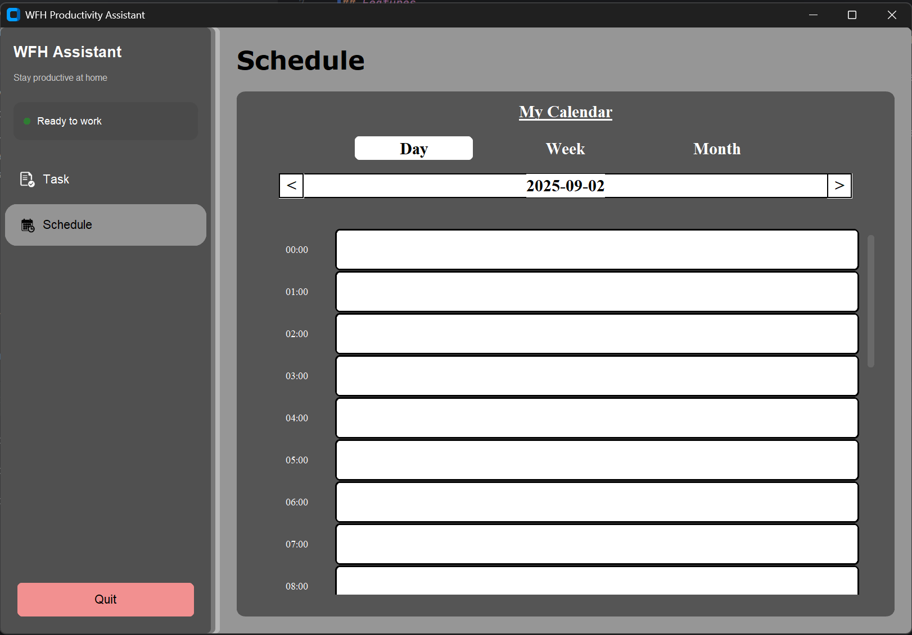
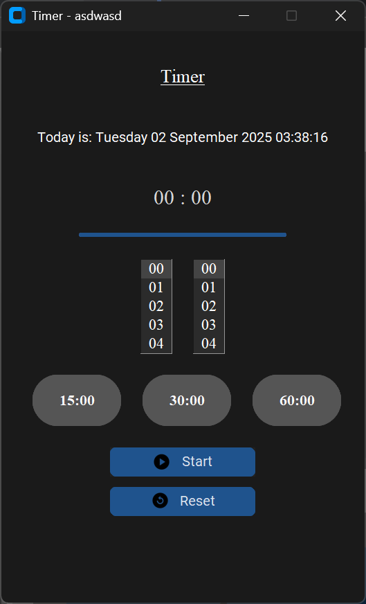

# WFH Productivity Assistant

A modern desktop application built with CustomTkinter for comprehensive work-from-home task management. This application
provides an intuitive GUI to help remote workers stay organized and productive with task tracking, project management,
and scheduling features.

## Features

- **Task Management**: Create, edit, and track tasks with different priorities and statuses
- **Project Management**: Organize work into projects with progress tracking
- **Schedule Manager**: Plan and manage your daily/weekly schedule with calendar integration
- **Pomodoro Timer**: Built-in productivity timer with audio notifications
- **Dark Theme UI**: Modern, eye-friendly interface built with CustomTkinter
- **Data Persistence**: Automatic saving of tasks, projects, and events to JSON files

## Screenshots

**Task Manager**


**Schedule Manager**


**Pomodoro Timer**



## Authors

- **Kong Ji Shou** - kongjs-wm23@student.tarc.edu.my
- **Khoo Kah Qin** - khookq-wm23@student.tarc.edu.my
- **Heng Wei Yi** - hengwy-wm23@student.tarc.edu.my

## Prerequisites

- Python 3.11 or higher
- Windows operating system (uses pywin32)

## Installation

### Method 1: Using uv (Recommended)

1. Install uv package manager:

```bash
pip install uv
```

2. Clone the repository:

```bash
git clone https://github.com/KJiShou/WFH-Productivity-Assistant.git
cd WFH-Productivity-Assistant
```

3. Install dependencies:

```bash
uv sync
```

### Method 2: Using pip

1. Clone the repository:

```bash
git clone https://github.com/KJiShou/WFH-Productivity-Assistant.git
cd WFH-Productivity-Assistant
```

2. Create a virtual environment:

```bash
python -m venv .venv
```

3. Activate the virtual environment:

```bash
# Windows
.venv\Scripts\activate
```

4. Install dependencies:

```bash
pip install customtkinter pillow pywin32 black
```

## Usage

### Running the Application

With uv:

```bash
uv run main.py
```

With standard Python:

```bash
python main.py
```

### Application Structure

The application opens with a sidebar navigation containing three main sections:

2. **Schedule Manager**: Calendar view for managing events and appointments
3. **Task Manager**: Comprehensive task and project management interface

### Data Files

The application automatically creates and maintains these data files:

- `tasks.json`: Stores all task information
- `projects.json`: Stores project data and progress
- `events.json`: Stores calendar events and schedule data

## Development

### Architecture

The application follows the MVC (Model-View-Controller) pattern:

- **Models** (`app/models/`): Data structures and business logic
- **Views** (`app/views/`): UI components built with CustomTkinter
- **Controllers** (`app/controllers/`): Handle user interactions and data flow
- **Utils** (`app/utils/`): Shared utilities including theme configuration

### Development Commands

Format code:

```bash
black .
```

Run linting:

```bash
uv run flake8
```

Run tests:

```bash
uv run pytest
```

### Project Structure

```
WFH-Productivity-Assistant/
├── app/
│   ├── assets/           # Icons, sounds, and images
│   ├── controllers/      # Application controllers
│   ├── models/          # Data models
│   ├── utils/           # Utilities and theme configuration
│   ├── views/           # UI components
│   │   └── components/  # Reusable UI components
│   └── app.py          # Main application entry point
├── main.py             # Application launcher
├── pyproject.toml      # Project configuration
├── *.json             # Data storage files
└── README.md          # This file
```

### Key Dependencies

- **CustomTkinter**: Modern tkinter-based GUI framework
- **Pillow**: Image processing for UI assets
- **pywin32**: Windows-specific functionality
- **Black**: Code formatting (development)
- **Flake8**: Code linting (development)
- **Pytest**: Testing framework (development)

## Contributing

1. Fork the repository
2. Create a feature branch (`git checkout -b feature/new-feature`)
3. Make your changes following the existing code style
4. Format code with Black: `black .`
5. Run linting: `uv run flake8`
6. Test your changes: `uv run pytest`
7. Commit your changes (`git commit -am 'Add new feature'`)
8. Push to the branch (`git push origin feature/new-feature`)
9. Create a Pull Request

### Development Guidelines

- Follow the existing MVC architecture pattern
- Use CustomTkinter for all UI components
- Maintain the dark theme consistency
- Add appropriate error handling
- Update tests when adding new features
- Follow PEP 8 style guidelines (enforced by Black)

## Support

For bug reports and feature requests, please open an issue on the GitHub repository.

---

*Built with ❤️ for remote workers everywhere*